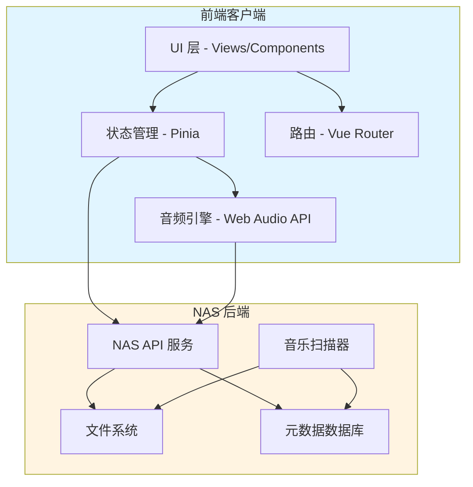
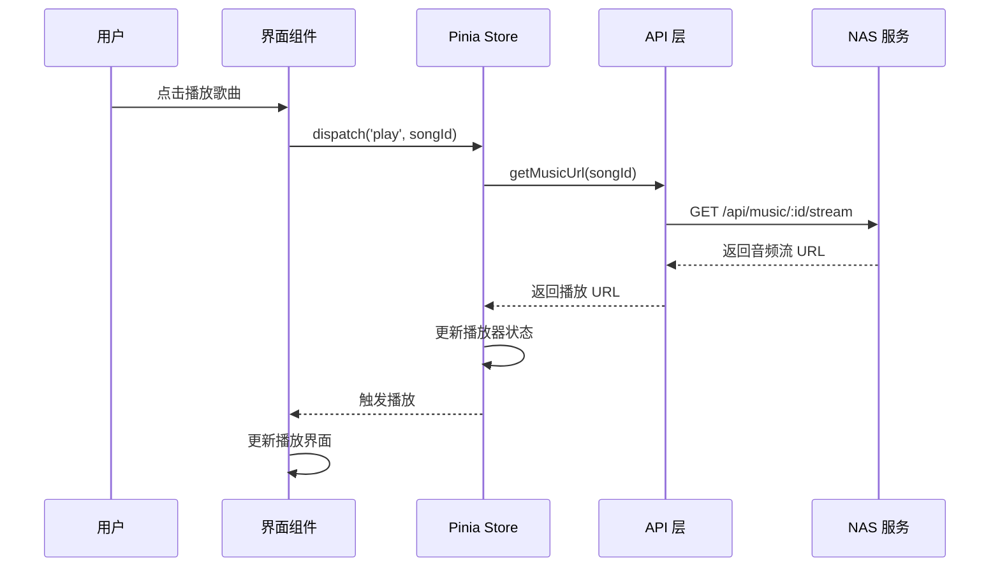
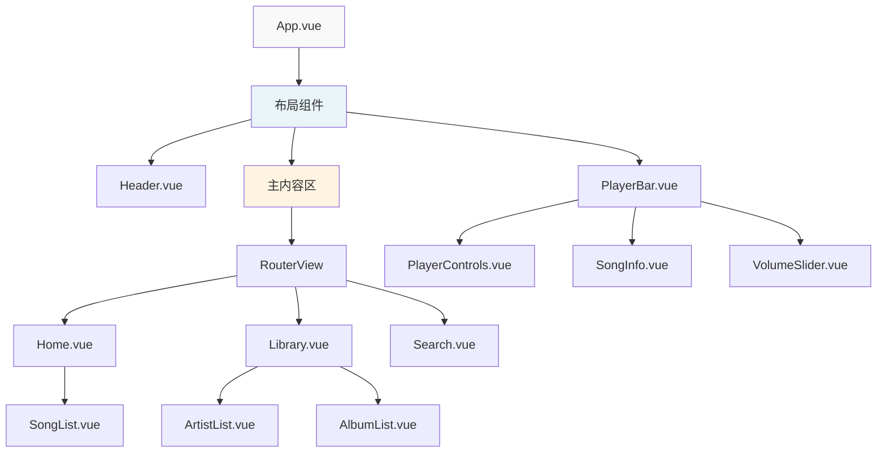

# 🏗️ NAS 音乐播放器 - 技术架构文档

**版本:** 1.1  
**日期:** 2026-03-28  
**状态:** 已更新最新版本

---

## 1. 技术栈选型 (最新版本)

### 前端核心

| 技术 | 选择 | 理由 | 最新版本 |
|------|------|------|---------|
| **框架** | Vue 3.5+ | 组合式 API，性能优秀，生态成熟 | `3.5.31` |
| **语言** | TypeScript | 类型安全，开发体验好 | `6.0.2` |
| **构建工具** | Vite | 极速冷启动，HMR 快速 | `8.0.3` |
| **路由** | Vue Router 5+ | 官方路由，支持懒加载 | `5.0.4` |
| **状态管理** | Pinia 3+ | 轻量，TypeScript 友好 | `3.0.4` |

### UI 与样式

| 技术 | 选择 | 理由 | 最新版本 |
|------|------|------|---------|
| **CSS 框架** | Tailwind CSS 4+ | 原子化 CSS，快速开发 | `4.2.2` |
| **组件库** | 自研组件 | 轻量，完全定制 | - |
| **图标** | Iconify / UnoCSS Icons | 按需加载，体积小 | - |
| **动画** | VueUse Motion | 轻量动画库 | - |

### 音频处理

| 技术 | 选择 | 理由 |
|------|------|------|
| **音频播放** | HTML5 Audio API | 原生支持，无需额外依赖 |
| **音频可视化** | Web Audio API | 频谱分析，可视化效果 |
| **歌词解析** | 自研解析器 | 支持 LRC 格式 |

### 开发工具

| 工具 | 选择 | 理由 |
|------|------|------|
| **代码规范** | ESLint + Prettier | 统一代码风格 |
| **类型检查** | Vue TSC | Vue 3 TypeScript 支持 |
| **测试框架** | Vitest + Vue Test Utils | 快速，Vite 原生支持 |
| **E2E 测试** | Playwright | 跨浏览器测试 |

---

## 2. 项目目录结构

```
nas-music-player/
├── 📁 .github/                    # GitHub 配置
│   └── workflows/                 # CI/CD 工作流
├── 📁 .vscode/                    # VSCode 配置
├── 📁 public/                     # 静态资源
│   ├── favicon.ico
│   └── manifest.json              # PWA 清单
├── 📁 src/
│   ├── 📁 api/                    # API 接口层
│   │   ├── index.ts               # API 导出
│   │   ├── request.ts             # HTTP 请求封装
│   │   ├── music.ts               # 音乐相关 API
│   │   └── playlist.ts            # 歌单相关 API
│   │
│   ├── 📁 assets/                 # 资源文件
│   │   ├── styles/                # 样式文件
│   │   │   ├── index.css          # 全局样式
│   │   │   ├── variables.css      # CSS 变量
│   │   │   └── tailwind.css       # Tailwind 配置
│   │   └── images/                # 图片资源
│   │
│   ├── 📁 components/             # 组件库
│   │   ├── 📁 common/             # 通用组件
│   │   │   ├── Button.vue
│   │   │   ├── Input.vue
│   │   │   ├── Slider.vue
│   │   │   └── Icon.vue
│   │   │
│   │   ├── 📁 layout/             # 布局组件
│   │   │   ├── Header.vue
│   │   │   ├── Sidebar.vue
│   │   │   ├── PlayerBar.vue      # 底部播放栏
│   │   │   └── MobileNav.vue      # 移动端导航
│   │   │
│   │   ├── 📁 music/              # 音乐相关组件
│   │   │   ├── SongList.vue       # 歌曲列表
│   │   │   ├── SongItem.vue       # 歌曲项
│   │   │   ├── AlbumCover.vue     # 专辑封面
│   │   │   ├── LyricsView.vue     # 歌词视图
│   │   │   └── PlayerControls.vue # 播放控制
│   │   │
│   │   └── 📁 playlist/           # 歌单组件
│   │       ├── PlaylistCard.vue
│   │       ├── PlaylistForm.vue
│   │       └── PlaylistList.vue
│   │
│   ├── 📁 composables/            # 组合式函数
│   │   ├── useAudio.ts            # 音频播放逻辑
│   │   ├── useLyrics.ts           # 歌词解析与同步
│   │   ├── usePlaylist.ts         # 歌单管理
│   │   ├── useSearch.ts           # 搜索功能
│   │   └── useResponsive.ts       # 响应式适配
│   │
│   ├── 📁 router/                 # 路由配置
│   │   ├── index.ts               # 路由主文件
│   │   └── routes.ts              # 路由定义
│   │
│   ├── 📁 stores/                 # Pinia 状态管理
│   │   ├── index.ts               # Store 导出
│   │   ├── player.ts              # 播放器状态
│   │   ├── music.ts               # 音乐库状态
│   │   └── playlist.ts            # 歌单状态
│   │
│   ├── 📁 types/                  # TypeScript 类型定义
│   │   ├── api.ts                 # API 类型
│   │   ├── music.ts               # 音乐相关类型
│   │   └── common.ts              # 通用类型
│   │
│   ├── 📁 utils/                  # 工具函数
│   │   ├── format.ts              # 格式化函数
│   │   ├── storage.ts             # 本地存储
│   │   └── validator.ts           # 验证函数
│   │
│   ├── 📁 views/                  # 页面视图
│   │   ├── Home.vue               # 首页
│   │   ├── Library.vue            # 音乐库
│   │   ├── Search.vue             # 搜索页
│   │   ├── Playlist.vue           # 歌单详情
│   │   ├── Player.vue             # 播放器全屏页
│   │   └── Settings.vue           # 设置页
│   │
│   ├── App.vue                    # 根组件
│   └── main.ts                    # 入口文件
│
├── 📁 tests/                      # 测试文件
│   ├── unit/                      # 单元测试
│   └── e2e/                       # E2E 测试
│
├── 📄 .editorconfig               # 编辑器配置
├── 📄 .eslintrc.cjs               # ESLint 配置
├── 📄 .prettierrc                 # Prettier 配置
├── 📄 .gitignore                  # Git 忽略文件
├── 📄 index.html                  # HTML 入口
├── 📄 package.json                # 项目依赖
├── 📄 postcss.config.js           # PostCSS 配置
├── 📄 tailwind.config.js          # Tailwind 配置
├── 📄 tsconfig.json               # TypeScript 配置
├── 📄 vite.config.ts              # Vite 配置
└── 📄 README.md                   # 项目说明
```

---

## 3. 系统架构图

### 3.1 整体架构



### 3.2 数据流



### 3.3 组件层级



---

## 4. 核心模块设计

### 4.1 音频播放模块

```typescript
// src/composables/useAudio.ts
interface UseAudioReturn {
  // 播放控制
  play: (url: string) => Promise<void>
  pause: () => void
  toggle: () => void
  seek: (time: number) => void
  
  // 播放列表
  next: () => void
  prev: () => void
  setPlaylist: (songs: Song[]) => void
  
  // 播放模式
  setMode: (mode: PlayMode) => void
  
  // 状态
  isPlaying: Ref<boolean>
  currentTime: Ref<number>
  duration: Ref<number>
  volume: Ref<number>
  currentSong: Ref<Song | null>
}
```

### 4.2 状态管理 (Pinia)

```typescript
// src/stores/player.ts
interface PlayerState {
  // 当前播放
  currentSong: Song | null
  isPlaying: boolean
  progress: number
  duration: number
  
  // 播放列表
  playlist: Song[]
  currentIndex: number
  playMode: 'sequence' | 'loop' | 'shuffle'
  
  // 音量
  volume: number
  isMuted: boolean
  
  // 播放历史
  history: Song[]
  favorites: string[] // 收藏的歌曲 ID
}
```

### 4.3 API 接口设计

```typescript
// src/api/music.ts
interface MusicAPI {
  // 获取音乐列表
  getMusicList(params: ListParams): Promise<ListResponse<Song>>
  
  // 获取歌曲详情
  getSongDetail(id: string): Promise<Song>
  
  // 获取播放 URL
  getPlayUrl(id: string, quality?: Quality): Promise<PlayUrlResponse>
  
  // 获取歌词
  getLyrics(id: string): Promise<LyricsResponse>
  
  // 搜索
  searchMusic(keyword: string, type?: SearchType): Promise<SearchResponse>
}

// src/api/playlist.ts
interface PlaylistAPI {
  // 获取歌单列表
  getPlaylists(): Promise<Playlist[]>
  
  // 创建歌单
  createPlaylist(data: CreatePlaylistDTO): Promise<Playlist>
  
  // 更新歌单
  updatePlaylist(id: string, data: UpdatePlaylistDTO): Promise<Playlist>
  
  // 删除歌单
  deletePlaylist(id: string): Promise<void>
  
  // 添加歌曲到歌单
  addSongToPlaylist(playlistId: string, songId: string): Promise<void>
  
  // 从歌单移除歌曲
  removeSongFromPlaylist(playlistId: string, songId: string): Promise<void>
}
```

---

## 5. 响应式设计策略

### 5.1 断点定义

```javascript
// tailwind.config.js
export default {
  theme: {
    screens: {
      'xs': '480px',   // 小屏手机
      'sm': '640px',   // 标准手机
      'md': '768px',   // 平板
      'lg': '1024px',  // 小屏电脑
      'xl': '1280px',  // 标准电脑
      '2xl': '1536px', // 大屏电脑
    }
  }
}
```

### 5.2 布局适配策略

| 断点 | 布局变化 | 导航方式 |
|------|---------|---------|
| **< 640px** | 单列布局，隐藏侧边栏 | 底部标签栏 |
| **640-768px** | 单列布局，优化触摸 | 底部标签栏 |
| **768-1024px** | 双列布局，显示侧边栏 | 侧边栏导航 |
| **> 1024px** | 三列布局，完整功能 | 侧边栏导航 |

### 5.3 播放器栏适配

```
移动端 (< 768px):
┌─────────────────────────────────┐
│ 封面  歌曲信息      ▶️  ❤️  ⋮  │
│       歌手名   ────────  50%    │
└─────────────────────────────────┘

平板端 (768-1024px):
┌─────────────────────────────────────────────┐
│ 封面  歌曲信息        ⏮  ▶️  ⏭   🔊 ───  ❤️ │
│       歌手名     ───────────────  2:30/4:00 │
└─────────────────────────────────────────────┘

桌面端 (> 1024px):
┌─────────────────────────────────────────────────────────┐
│ 封面  歌曲信息  专辑名    ⏮  ▶️  ⏭   📋  🔀  🔊 ───  ❤️ │
│       歌手名           ─────────────────  2:30/4:00    │
└─────────────────────────────────────────────────────────┘
```

---

## 6. 安全设计

### 6.1 认证策略

```typescript
// 可选配置：如果 NAS 需要认证
interface AuthConfig {
  // 认证方式
  type: 'none' | 'token' | 'basic' | 'oauth'
  
  // Token 存储
  tokenStorage: 'localStorage' | 'sessionStorage' | 'cookie'
  
  // Token 刷新
  refreshToken: boolean
  refreshInterval: number // ms
}
```

### 6.2 API 安全

- ✅ 所有 API 请求添加认证头（如果需要）
- ✅ HTTPS 强制（生产环境）
- ✅ CORS 配置限制来源
- ✅ 请求频率限制
- ✅ 输入验证和 sanitization

### 6.3 内容安全

```html
<!-- Content-Security-Policy -->
<meta http-equiv="Content-Security-Policy" 
      content="default-src 'self'; 
               media-src 'self' blob: data:; 
               style-src 'self' 'unsafe-inline'; 
               script-src 'self' 'unsafe-inline';">
```

---

## 7. 性能优化策略

### 7.1 加载优化

| 优化项 | 策略 | 目标 |
|-------|------|------|
| **首屏加载** | 路由懒加载 + 组件异步加载 | < 2s |
| **图片加载** | 懒加载 + WebP 格式 | 减少 50% 体积 |
| **音频加载** | 分段加载 + 预加载下一首 | 无缝播放 |
| **列表渲染** | 虚拟滚动（> 100 项） | 流畅滚动 |

### 7.2 缓存策略

```typescript
// 缓存配置
const cacheConfig = {
  // 音乐元数据缓存
  musicMetadata: {
    strategy: 'cache-first',
    maxAge: 3600000, // 1 小时
  },
  
  // 专辑封面缓存
  albumCover: {
    strategy: 'cache-first',
    maxAge: 86400000, // 24 小时
  },
  
  // 歌词缓存
  lyrics: {
    strategy: 'cache-first',
    maxAge: 604800000, // 7 天
  },
}
```

### 7.3 Bundle 优化

```typescript
// vite.config.ts
import { defineConfig } from 'vite'

export default defineConfig({
  build: {
    rollupOptions: {
      output: {
        manualChunks: {
          'vue-vendor': ['vue', 'vue-router', 'pinia'],
          'audio-vendor': ['@vueuse/core'],
        }
      }
    }
  }
})
```

---

## 8. 测试策略

### 8.1 测试金字塔

```
        /\
       /  \      E2E 测试 (Playwright)
      /----\     - 关键用户流程
     /      \    - 跨浏览器测试
    /--------\   
   /  集成测试  \  - 组件交互
  /--------------\ - Store + API
 /    单元测试      \ - 工具函数
/------------------\ - Composables
```

### 8.2 测试覆盖率目标

| 类型 | 目标覆盖率 |
|------|----------|
| 语句覆盖率 | > 80% |
| 分支覆盖率 | > 70% |
| 函数覆盖率 | > 90% |
| 行覆盖率 | > 80% |

---

## 9. 部署方案

### 9.1 开发环境

```bash
# 本地开发
npm run dev

# 访问 http://localhost:5173
```

### 9.2 生产环境

#### 方案 A: 静态文件部署（推荐）

```bash
# 构建
npm run build

# 输出到 dist/ 目录
# 将 dist/ 部署到 NAS 的 Web 服务器
```

#### 方案 B: Docker 容器

```dockerfile
FROM nginx:alpine
COPY dist/ /usr/share/nginx/html
COPY nginx.conf /etc/nginx/conf.d/default.conf
EXPOSE 80
CMD ["nginx", "-g", "daemon off;"]
```

### 9.3 NAS 集成

```
NAS 文件系统
├── /volume1/music/          # 音乐文件
├── /volume1/docker/         # Docker 容器
│   └── nas-music-player/    # 播放器容器
└── /volume1/web/            # Web 服务
    └── music-player/        # 静态文件
```

---

## 10. 技术决策记录 (ADR)

### ADR-001: 选择 Vue 3 而非 React

**日期:** 2026-03-28  
**状态:** 已采纳

**背景:**
- 团队对 Vue 更熟悉
- Vue 3 组合式 API 提供更好的代码组织
- TypeScript 支持成熟

**决策:** 使用 Vue 3 + TypeScript

**后果:**
- ✅ 开发效率高
- ✅ 学习曲线平缓
- ⚠️ 生态略小于 React

---

### ADR-002: 使用 Tailwind CSS

**日期:** 2026-03-28  
**状态:** 已采纳

**背景:**
- 需要快速开发响应式界面
- 需要高度定制化
- 避免组件库的样式限制

**决策:** 使用 Tailwind CSS 作为 CSS 框架

**后果:**
- ✅ 开发速度快
- ✅ 样式一致性高
- ⚠️ HTML 中 class 较长

---

### ADR-003: 使用 HTML5 Audio 而非第三方库

**日期:** 2026-03-28  
**状态:** 已采纳

**背景:**
- 功能需求相对简单
- 第三方库（如 Howler.js）增加包体积
- 浏览器原生支持已足够

**决策:** 使用原生 HTML5 Audio API

**后果:**
- ✅ 包体积小
- ✅ 无额外依赖
- ⚠️ 需要自己处理边界情况

---

### ADR-004: 使用最新版本

**日期:** 2026-03-28  
**状态:** 已采纳

**背景:**
- Vite 已发布 v8.0.3
- Vue 已发布 v3.5.31
- 新版本带来性能提升和新特性

**决策:** 所有依赖使用最新稳定版本

**后果:**
- ✅ 最佳性能
- ✅ 最新特性
- ✅ 长期支持
- ⚠️ 可能需要处理新版本的 breaking changes

---

## 11. 待确认事项

- [ ] NAS 后端 API 的具体接口定义
- [ ] 是否需要 PWA 支持（离线播放）
- [ ] 是否需要 WebSocket 实时更新
- [ ] 音乐元数据由谁提供（前端解析/后端提供）
- [ ] 是否需要转码支持（后端处理）

---

**下一步:**
1. ✅ 需求分析完成
2. ✅ 架构设计完成
3. ✅ UI 设计完成
4. ⏳ 进入编码实现阶段
